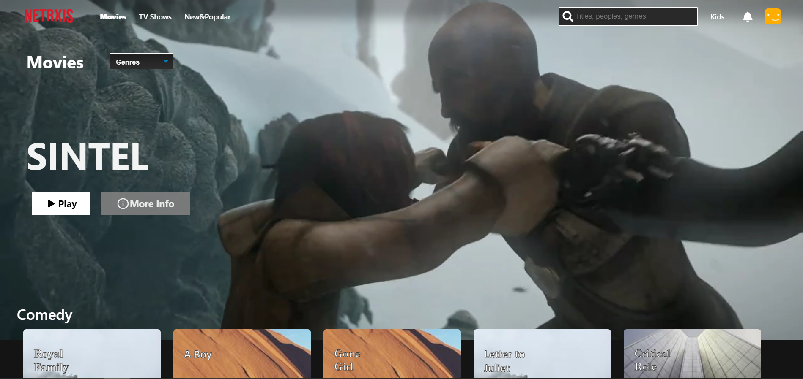

# NetRXis - A Netflix Clone

Built using React and RxJs to handle async events such as requests, streaming, user interactions. For the backend it's just a simple Express Server. The main watchable video
is being streamed, while the rest of the movie data is generated upon starting the server.

Contains the follwing :
 - mock login page with cancellable request
 - fetching data
 - loader implementation
 - mock filtering through search, select or type change
 - user interaction with  movie cards
 - auto play for main movie with cover switch after x seconds
 - transition/cancel into movie streaming
 - liking/dislking movies
 - store implementation using BehaviourSubject
 - decent UI
## Purpose

The purpose of this small project was to learn more about RxJs. Getting both tools to integrate with each other nicely was quite a task, so shortcuts had to be taken along the way. You might see functionality implemented "not in a React way".

## Installation

Use the package manager to install both the client and the server.

```bash
cd client
npm install
cd server
npm install
```

## Contributing
Pull requests are welcome. For major changes, please open an issue first to discuss what you would like to change.